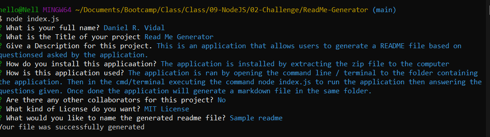
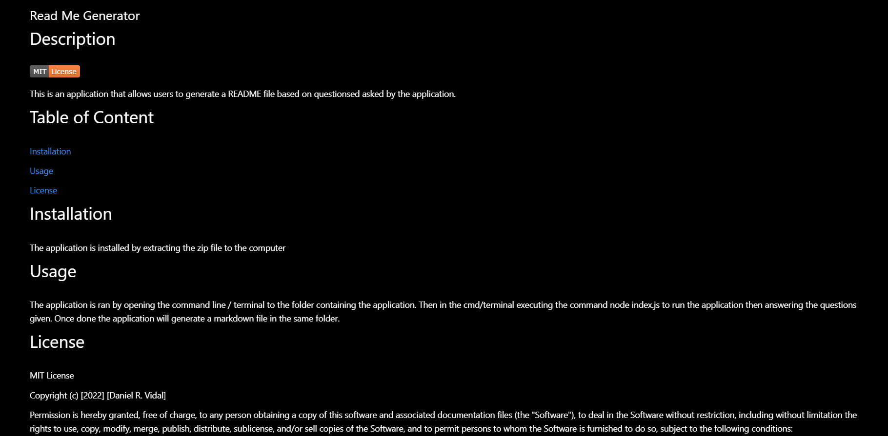

# ReadMe-Generator

## Description
This is an Command Line application to allow users to create a detailed ReadMe file.

[Link to video on how to use](https://drive.google.com/file/d/1KP-BWXQejxLs1fSwrFGfVkEORoAcsS_d/view)

# Installation

The application is installed by extracting the zip file to the computer. Then you will need to open a command line / terminal to the folder containing the app and run the command npm install.

In order to run this program you will need to have node installed on your computer.

Node can be found [here](https://nodejs.org/en/download/)

# Usage

This application is ran by opening a cmd/terminal to the folder containing the app, then in the cmd/terminal run the command node index.js, then answer the prompts given in the cmd/terminal. Once done you will be asked to give the file a name.

## Screenshots

## License
MIT License

Copyright (c) 2022 Daniel Vidal

Permission is hereby granted, free of charge, to any person obtaining a copy
of this software and associated documentation files (the "Software"), to deal
in the Software without restriction, including without limitation the rights
to use, copy, modify, merge, publish, distribute, sublicense, and/or sell
copies of the Software, and to permit persons to whom the Software is
furnished to do so, subject to the following conditions:

The above copyright notice and this permission notice shall be included in all
copies or substantial portions of the Software.

THE SOFTWARE IS PROVIDED "AS IS", WITHOUT WARRANTY OF ANY KIND, EXPRESS OR
IMPLIED, INCLUDING BUT NOT LIMITED TO THE WARRANTIES OF MERCHANTABILITY,
FITNESS FOR A PARTICULAR PURPOSE AND NONINFRINGEMENT. IN NO EVENT SHALL THE
AUTHORS OR COPYRIGHT HOLDERS BE LIABLE FOR ANY CLAIM, DAMAGES OR OTHER
LIABILITY, WHETHER IN AN ACTION OF CONTRACT, TORT OR OTHERWISE, ARISING FROM,
OUT OF OR IN CONNECTION WITH THE SOFTWARE OR THE USE OR OTHER DEALINGS IN THE
SOFTWARE.
